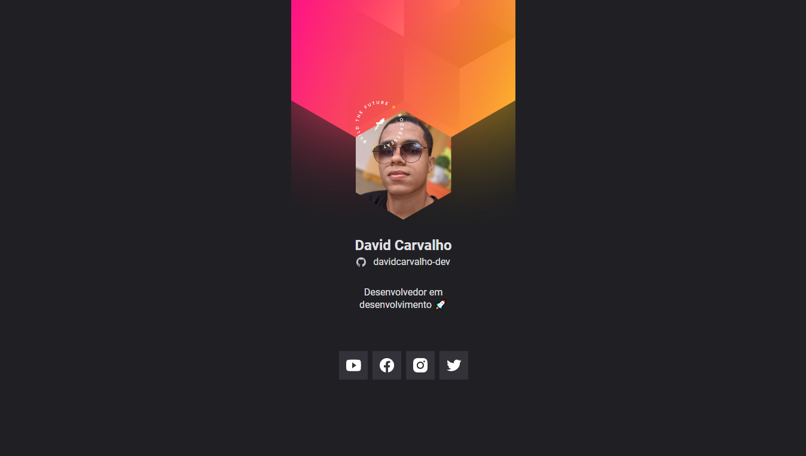

<h1 align="center">NLW-Heat</h1>

## Sobre
Projeto desenvolvido no evento NLW heat da Rocketseat, o obejtivo foi criar um crachá virtual para o evento DoWhile 2021 promovido pela empresa em dezembro de 2021, a cereimônia tem o intuito de reunir comunidades, tecnologias e empresas do ramo da programação em um único ecossistema cooperativo.

## Tecnologias utilizadas

   
   
   
 

 
 ## Como executar o projeto
 Basta baixar o projeto em formato ZIP, extrair e executar o arquivo index.html que se econtra do no diretório raiz do projeto.
